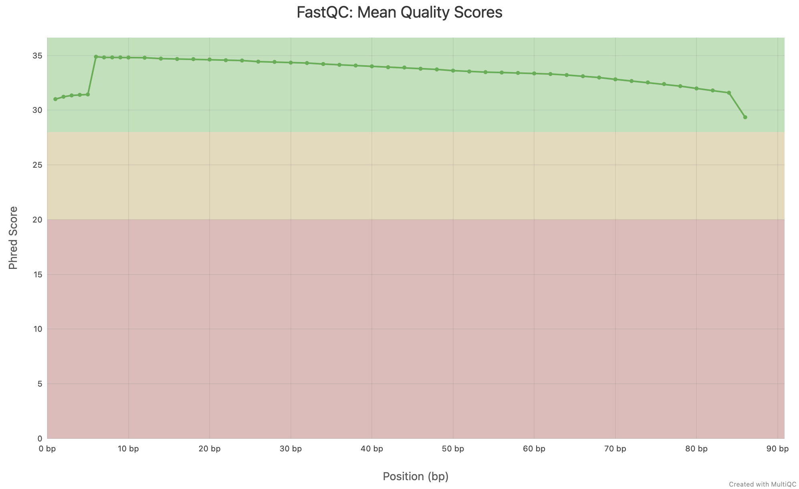
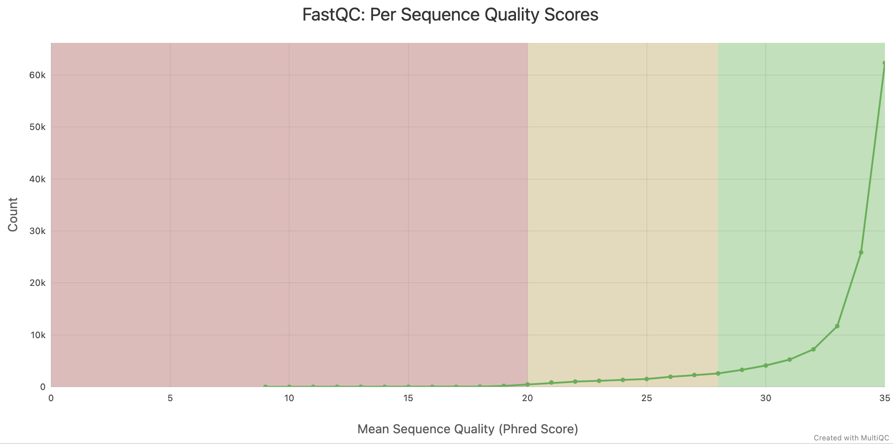

# Lesson 01. Report for 21/04

> Anna Miletova, 89231151

## 1. Installation of the data

Using the [SRA database](https://sra-explorer.info/) I found the dataset from the paper *"Wolbachia pipientis modulates germline stem cells and gene expression associated with ubiquitination and histone lysine trimethylation to rescue fertility defects in Drosophila"* by BioProject PRJNA1166928. I chose the sample **SRR30833060**.

I have downloaded the sequence from SRA database using **fastq-dump** from **sra-tools** package with the following command:

```bash
conda install -c bioconda sra-tools -y
fastq-dump --origfmt --skip-technical --read-filter pass --clip --split-3 -X 500000 SRR30833060
```

## 2. Quality control of the data

I installed and ran FastQC:

```bash
conda install -c bioconda fastqc -y
conda install -c bioconda multiqc -y

fastqc SRR30833060_pass.fastq
multiqc .
```

I received the following results:

### Statistics from FastQC:

| Measure | Value |
| --- | --- |
| Filename | SRR30833060_pass.fastq |
| File type | Conventional base calls |
| Encoding | Sanger / Illumina 1.9 |
| Total Sequences | 133076 |
| Total Bases | 11.4 Mbp |
| Sequences flagged as poor quality | 0 |
| Sequence length | 86 |
| %GC | 38 |


### Statistics from MultiQC:

| Dupes | GC | Seqs |
| --- | --- | --- |
| 19.0% | 38.0% | 0.1M |

Unique Reads: 107,743
Duplicate Reads: 25,333


### Summary 

The dataset contains 133,076 reads of length 86 bp, which is consistent and indicates no variable-length trimming issues. The GC content (38%) appears reasonable. The duplication level (19%) is moderate and acceptable for most datasets. No sequences were flagged as poor quality, indicating overall high sequencing quality.


## 3. Questions

### How is a fastq file composed?

FASTQ file consists of 4-line blocks, each of them contains information about single read. First line -- SEQ_ID, usually having the following structure: `@<instrument>:<run_number>:<flowcell_ID>:<lane>:<tile>:<x_pos>:<y_pos>:<UMI> <read>:<is_filtered>:<control_number>:<index>`; second line -- sequence of bases; third line -- a plus sign; fourth line -- quality scores for each base in the sequence, encoded as ASCII characters.


### How can I count the number of reads in a fastq file? Describe different ways to perform that. 

There are several ways to count the number of reads in a FASTQ file:

1. Command line:

    ```bash
    echo $(($(wc -l < file.fastq) / 4))
    ```

    Returns the number immediately.

2. Using FastQC:

    ```bash
    fastqc file.fastq
    ```

    In the FastQC report, the total number of sequences is provided in the "Basic Statistics" section.

3. Using MultiQC:

    ```bash
    multiqc .
    ```

    In the MultiQC report, the total number of sequences is summarized in the "General Statistics" section.

4. Using seqkit:

    ```bash
    seqkit stats file.fastq
    ```

    It provides a summary of the FASTQ file, including the total number of sequences.


### What about the quality of your reads?

The GC content is around 38%, which is within the expected range for many organisms. There are no sequences flagged as poor quality, and the percentage of duplicate reads is relatively low at 19%. Overall, the data appears to be of good quality.

### Describe your fastqc and/or multiqc and interpret the results. 

Quality of the reads seems to be good, since Phred Scores are mostly above 30, which means that the probability of an incorrect base call is less than 1 in 1000. 



Graph starts around Q31–32, quickly stabilizes at Q35 and gradual decline toward end (~Q29 at ~85 bp). Entire curve stays in green zone (>Q30), indicating high-quality reads throughout.

