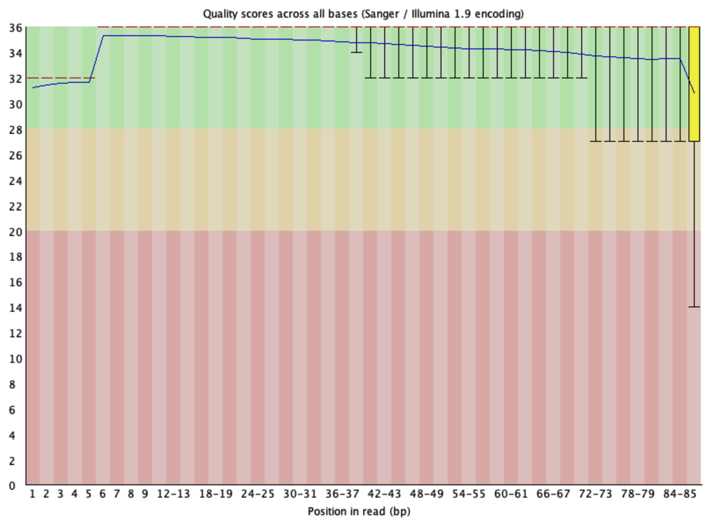
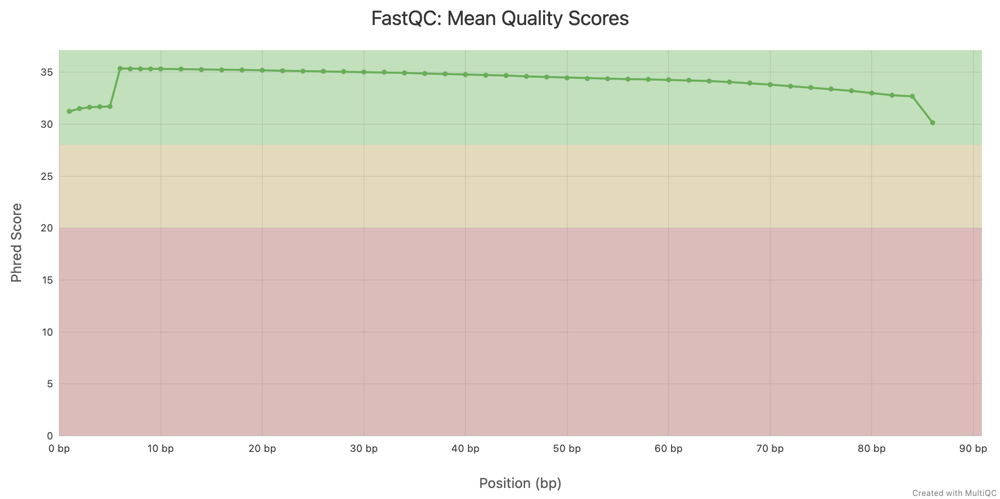

# Lesson 02. Report for 05/05

> Anna Miletova, 89231151


## 1. Installation

I installed fastp package via conda bioconda channel:

```bash
conda install -c bioconda fastp -y
```

Ran the following command to trim the reads using fastp:

```bash
fastp -i ../l1/SRR30833060_pass.fastq -o ./SRR30833060.trimmed.fq -V --html ./fastp_report.html -u 30 -x -3
```

***Options explained:***

- `-i` - Input file
- `-o` - Output file
- `-V` - Verbose output
- `--html` - Output HTML report
- `-u 30` - Trim bases with quality below 30
- `-x` - Enable poly tail trimming
- `-3` - Enable 3' end trimming


### FastP report summary:

| | **Before filtering** | **After filtering** |
| --- | --- | --- |
| Total reads | 133076 | 123044 |
| Total bases | 11444536 | 10080821 |
| Q20 bases | 10571771 (92.37%) | 9667557 (95.90%) |
| Q30 bases | 10242011 (89.49%) | 9432416 (93.57%) |
| Q40 bases | 0 (0.00%) | 0 (0.00%) |
| GC content | 38.44% | 40.21% |


**Filtering result**:
- **reads passed filter**: 123044
- **reads failed due to low quality**: 8763
- **reads failed due to too many N**: 26
- **reads failed due to too short**: 1087
- **reads failed due to adapter dimer**: 156
- **reads with adapter trimmed**: 2514
- **bases trimmed due to adapters**: 36226
- **reads with polyX in 3' end**: 22072
- **bases trimmed in polyX tail**: 504287


## 2. Quality control of the data with FastQC

```bash
fastqc SRR30833060.trimmed.fq
multiqc .
```

### FastQC

The results of FastQC after trimming are as follows:

Basic Statistics

| Measure | Value |
| --- | --- |
| Filename | SRR30833060.trimmed.fq |
| File type | Conventional base calls |
| Encoding | Sanger / Illumina 1.9 |
| Total Sequences | 123044 |
| Total Bases | 10 Mbp |
| Sequences flagged as poor quality | 0 |
| Sequence length | 15-86 |
| %GC | 40 |





### MultiQC

The results of MultiQC after trimming are as follows:



## 3. Reference alignment

I installed NCBI datasets command-line tool and downloaded the reference genome for *Drosophila melanogaster* (GCF_000001215.4):

```bash
conda install conda-forge::ncbi-datasets-cli
mkdir ./ref
datasets download genome accession GCF_000001215.4 --include genome,rna,protein,cds,gff3,gtf --filename ./ref/drosophila_melanogaster.zip
unzip ./ref/drosophila_melanogaster.zip -d ./ref
```

### Questions: 

> Describe the GTF.


> Examine GTF files. Which information can be found in these files? 

GTF file contains information about gene and transcript annotations. Header lines (starting with `#!`) provide metadata about the genome build, annotation source, and other relevant information. Each subsequent line represents a genomic feature (e.g., gene, transcript, exon) with fields such as sequence name, source, feature type, start and end positions, strand, and various attributes (such as gene_id, transcript_id, db_xref, gene, locus_tag, note, orig_transcript_id, orig_protein_id, product, transcript_biotype, exon_number, gene_synonym, etc.).

> How many genes are present?

There are 17,872 genes present in the GTF file for *Drosophila melanogaster* (GCF_000001215.4).

> Provide me the commands and results for counting the number of sequences in the various fasta files (DNA, RNA, protein).

To count the number of sequences in the various FASTA files, you can use the following commands:

- Count DNA sequences

    ```bash
    grep -c "^>" ./ref/ncbi_dataset/data/GCF_000001215.4/GCF_000001215.4_Release_6_plus_ISO1_MT_genomic.fna
    ```
    ***Result: 1870***

- Count RNA sequences

    ```bash
    grep -c "^>" ./ref/ncbi_dataset/data/GCF_000001215.4/rna.fna
    ```

    ***Result: 34,526***

- Count protein sequences

    ```bash
    grep -c "^>" ./ref/ncbi_dataset/data/GCF_000001215.4/protein.faa
    ```

    ***Result: 30,802***


> Describe differences between different genomic fasta files. 

Later I installed HISAT2 

```bash
conda create -n hisat2
conda activate hisat2
conda install -c bioconda hisat2
```

Created index for the reference genome:

```bash
mkdir ./hisat_index
cd ./hisat_index
hisat2-build  ../ref/ncbi_dataset/data/GCF_000001215.4/GCF_000001215.4_Release_6_plus_ISO1_MT_genomic.fna genome
```

Mapped the reads to the reference genome:

```bash
hisat2 \
  -p 4 \
  -x ./genome \
  -U ../SRR30833060.trimmed.fq \
  --known-splicesite-infile splicesites.txt \
  -S aligned.sam
```


The result of the alignment is as follows:

    123044 reads; of these:
    123044 (100.00%) were unpaired; of these:
        6877 (5.59%) aligned 0 times
        109851 (89.28%) aligned exactly 1 time
        6316 (5.13%) aligned >1 times

**94.41%** overall alignment rate


### Questions to answer

> How many input reads were mapped uniquely?

109,851 (89.28%) reads were mapped uniquely to the reference genome, of the total input reads (123,044).

> How many reads were mapped to multiple loci?

6,316 (5.13%) reads were mapped to multiple loci in the reference genome.


## 4. Salmon quantification

I installed Salmon package via conda bioconda channel (as always):

```bash
conda create -n salmon
conda activate salmon
conda install -c bioconda salmon
```

Then created index and performed quantification:

```bash
salmon index -t ./ref/ncbi_dataset/data/GCF_000001215.4/rna.fna -i salmon_index
salmon quant -i salmon_index -l A -r ./SRR30833060.trimmed.fq -o salmon_quant
```

Checking output:

```bash
head ./salmon_quant/quant.sf
```

*Returns:*

    Name              Length    EffectiveLength   TPM          NumReads
    NM_001007095.3    6363      6113.000          1.382191     3.136
    NM_001007096.3    6200      5950.000          1.574042     3.476
    NM_001014453.2    4818      4568.000          0.000000     0.000
    NM_001014454.2    2731      2481.000          0.000000     0.000
    NM_001014455.2    2639      2389.000          3.383817     3.000
    NM_001014456.1    1161      911.000           0.000000     0.000
    NM_001014457.3    403       153.000           0.000000     0.000
    NM_001014458.5    2777      2527.000          0.000000     0.000
    NM_001014459.2    2998      2748.000          0.000000     0.000


### Summary of the quantification results:

Sum of NumReads values: ***103,320***
```bash
awk 'NR>1 {sum+=$5} END {print sum}' ./salmon_quant/quant.sf
```
I.e., total number of reads Salmon could confidently assign to transcripts is 103,320 out of 123,044 input reads, which is approximately 84.0% of the total reads.

Number of transcripts with TPM > 1: ***6,786***
```bash
awk 'NR>1 && $4>1 {count++} END {print count}' ./salmon_quant/quant.sf
```
I.e., 6,786 transcripts have a TPM value greater than 1, indicating they are expressed at a level that is likely biologically meaningful in this sample.


The top 10 most highly expressed transcripts (by TPM) are:
```bash
$ sort -k4,4nr ./salmon_quant/quant.sf | head

NR_133508.1     361     111.000   265309.321933   10928.878
NR_047748.1     249     19.269    112013.551364   801.000
NR_001599.2     164     5.913     47224.483515    103.624
NM_001014551.3  320     70.188    46876.736063    1221.000
NM_057437.4     491     241.000   19265.043830    1723.000
NM_057966.5     288     41.248    19206.406913    294.000
NR_002081.1     107     3.670     19091.844604    26.000
NR_001646.1     192     8.045     17379.171520    51.884
NR_002544.2     210     10.181    12905.508061    48.760
NR_001647.1     127     4.263     12815.594954    20.273
```


Transcript abundance was quantified using Salmon. A transcriptome index was built from the reference RNA FASTA file downloaded from NCBI. Since the RNA-seq sample was single-end, Salmon was run with the -r option rather than paired-end -1/-2 input files. The library type was automatically detected using -l A, and transcript-level expression estimates were written to quant.sf.
