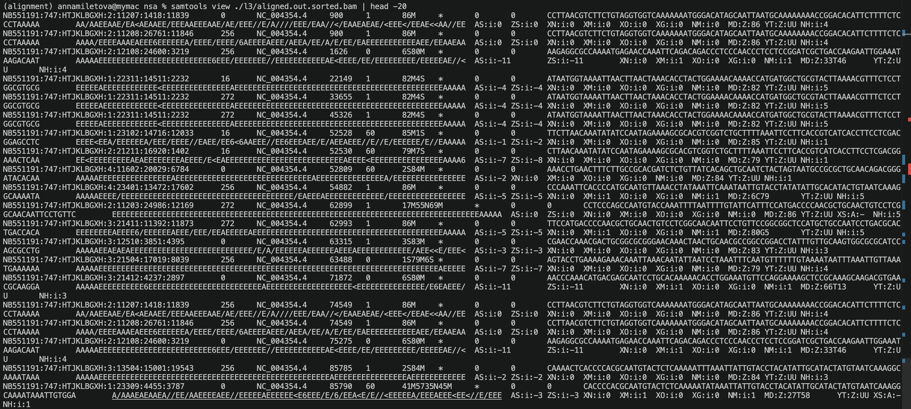
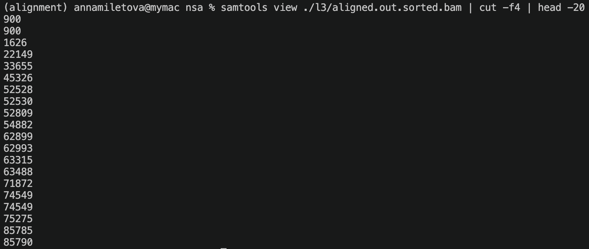
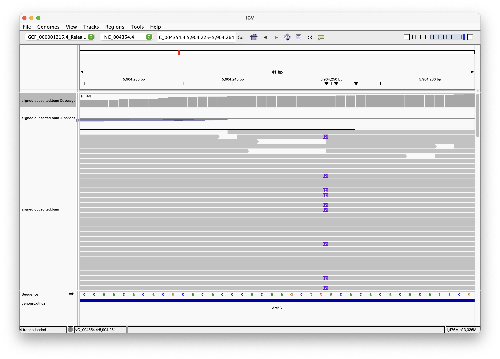
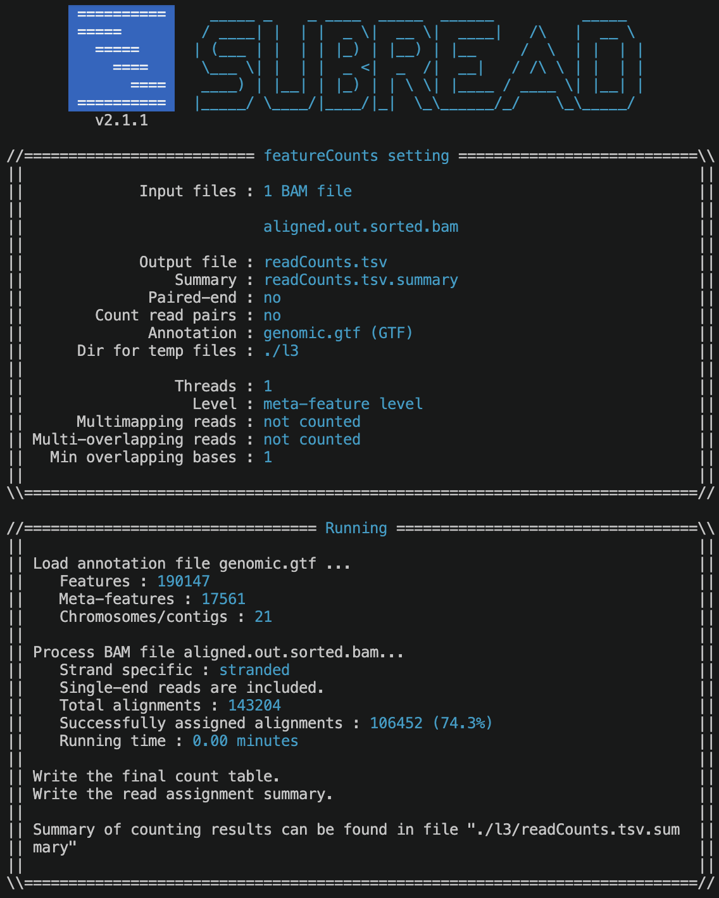

# Lesson 03. Report for 12/05

> Anna Miletova, 89231151


## 1. Installation

Fist things first, I created new conda environment and installed samtools and tablet packages:

```bash
conda create -n alignment -y
conda activate alignment

conda install -c bioconda samtools -y
conda install -c bioconda tablet -y
```

## 2. Alignment of the reads

Using samtools I converted sam file to bam, sorted the bam file according to the location of reads on the reference genome and created index of bam file with samtools (it is required by Tablet to visualize the alignment). I also created index of reference genome fasta file.

```bash
# convert sam file to bam
samtools view -o ./l3/aligned.out.bam ./l2/hitsat_index/aligned.sam

# sort bam file according to the location of reads on the reference genome
samtools sort -o ./l3/aligned.out.sorted.bam ./l3/aligned.out.bam

# create index of bam file with samtools (it is required by Tablet to visualize the alignment)
samtools index ./l3/aligned.out.sorted.bam

# create index of reference genome fasta file
samtools faidx ./l2/ref/ncbi_dataset/data/GCF_000001215.4/GCF_000001215.4_Release_6_plus_ISO1_MT_genomic.fna
mv ./l2/ref/ncbi_dataset/data/GCF_000001215.4/GCF_000001215.4_Release_6_plus_ISO1_MT_genomic.fna.fai ./l3/reference_index.fna.fai
```

Flags in the sam file:

```bash
samtools flagstat ./l2/hitsat_index/aligned.sam
```

**Result:**
```
143204 + 0 in total (QC-passed reads + QC-failed reads)
123044 + 0 primary
20160 + 0 secondary
0 + 0 supplementary
0 + 0 duplicates
0 + 0 primary duplicates
136327 + 0 mapped (95.20% : N/A)
116167 + 0 primary mapped (94.41% : N/A)
0 + 0 paired in sequencing
0 + 0 read1
0 + 0 read2
0 + 0 properly paired (N/A : N/A)
0 + 0 with itself and mate mapped
0 + 0 singletons (N/A : N/A)
0 + 0 with mate mapped to a different chr
0 + 0 with mate mapped to a different chr (mapQ>=5)
```

### Tasks:

- ***Include a screenshot of the sorted.bam file to confirm that the reads were sorted based on the reference genome position.***

    ```bash
    samtools view -h ./l3/aligned.out.sorted.bam | head -n 20
    ```

    

    For better readability, I also only took the 4th column to show sortedness of the bam file:

    ```bash
    samtools view ./l3/aligned.out.sorted.bam | cut -f4 | head -20
    ```

    

- ***Which column in the sam or bam file contains the leftmost mapping position?***

    In a SAM file, the 4th column (POS) contains the leftmost mapping position on the reference genome.

    | Column | Name | Meaning |
    |--------|------|---------|
    | 1 | QNAME | Read name |
    | 2 | FLAG | Alignment flags |
    | 3 | RNAME | Reference chromosome |
    | 4 | POS | Leftmost mapping position |
    | 5 | MAPQ | Mapping quality |
    | 6 | CIGAR | Alignment representation |


- ***How to retrieve the unmapped reads from a bam file?***

    Flag 4 in the SAM/BAM file indicates unmapped reads. To retrieve unmapped reads from a BAM file, you can use the following command:

    ```bash
    samtools view -f 4 -b ./l3/aligned.out.sorted.bam > ./l3/unmapped.sam
    samtools view -f 4 -b ./l3/aligned.out.sorted.bam > ./l3/unmapped.bam
    ```


## 3. IGV visualization

I zipped GTF file to load it in IGV:

```bash
bgzip ./l2/ref/ncbi_dataset/data/GCF_000001215.4/genomic.gtf
```

I loaded reference genome fasta file, sorted bam file and the zipped GTF file as annotation track to IGV. I visualized the Act5c gene, which is a highly expressed gene in *Drosophila melanogaster*.




## 4. Infer experiment

```bash
conda create -n featurecounts -c bioconda -c conda-forge subread rseqc bedops samtools
conda activate featurecounts
```


```bash
gunzip ./l2/ref/ncbi_dataset/data/GCF_000001215.4/genomic.gtf.gz
gtf2bed < ./l2/ref/ncbi_dataset/data/GCF_000001215.4/genomic.gtf > ./l3/genomic.bed

infer_experiment.py \
  -r ./l3/genomic.bed \
  -i ./l3/aligned.out.sorted.bam
```

**Result:**
```
This is SingleEnd Data
Fraction of reads failed to determine: 0.0864
Fraction of reads explained by "++,--": 0.9096
Fraction of reads explained by "+-,-+": 0.0041
```

Since the fraction of reads explained by "++,--" is much higher than the fraction of reads explained by "+-,-+", we can conclude that the library is stranded, thus we can use the `-s 1` flag in downstream analysis.

```bash
featureCounts -a ./l2/ref/ncbi_dataset/data/GCF_000001215.4/genomic.gtf -o ./l3/readCounts.tsv -s 1 ./l3/aligned.out.sorted.bam
```



### Results:

```
Status	./l3/aligned.out.sorted.bam
Assigned	106452
Unassigned_Unmapped	6877
Unassigned_Read_Type	0
Unassigned_Singleton	0
Unassigned_MappingQuality	0
Unassigned_Chimera	0
Unassigned_FragmentLength	0
Unassigned_Duplicate	0
Unassigned_MultiMapping	26476
Unassigned_Secondary	0
Unassigned_NonSplit	0
Unassigned_NoFeatures	1495
Unassigned_Overlapping_Length	0
Unassigned_Ambiguity	1904
```

- ***Check which are the 10 most expressed genes. Is there a correspondence with the results of Salmon?***

```bash
tail -n +3 ./l3/readCounts.tsv \
| sort -k7,7nr \
| head -10
```

***Results:***

```bash
Dmel_CR34335    NC_004354.4;NC_004354.4 3545750;3545862 3546110;3546110 -;-     361     10884
Dmel_CR34094    NC_024511.2     12735   14058   -       1324    6657
Dmel_CG9271     NT_033779.5     13411141        13411631        -       491     1807
Dmel_CG9048     NT_033779.5;NT_033779.5 5959596;5959700 5960340;5960340 -;-     745     1591
Dmel_CG2985     NC_004354.4;NC_004354.4;NC_004354.4;NC_004354.4 10053811;10053852;10054214;10054214     10054136;10054136;10055498;10055498     +;+;+;+ 1611 1252
Dmel_CG30425    NT_033778.4;NT_033778.4;NT_033778.4     24903416;24903698;24903881      24903589;24903788;24903935      -;-;-   320     1231
Dmel_CG9046     NT_033779.5;NT_033779.5 5957004;5957004 5957639;5957628 +;+     636     940
Dmel_CG2979     NC_004354.4;NC_004354.4;NC_004354.4;NC_004354.4 10050951;10051016;10052349;10052349     10052280;10052280;10052636;10052634     -;-;-;- 1618 926
Dmel_CG4918     NT_033778.4     16586129        16586732        +       604     800
Dmel_CG6519     NT_037436.4;NT_037436.4 8728481;8728610 8728538;8729066 +;+     515     645
```

Recall of Salmon results (the top 10 most highly expressed transcripts):

```bash
NR_133508.1     361     111.000   265309.321933   10928.878
NR_047748.1     249     19.269    112013.551364   801.000
NR_001599.2     164     5.913     47224.483515    103.624
NM_001014551.3  320     70.188    46876.736063    1221.000
NM_057437.4     491     241.000   19265.043830    1723.000
NM_057966.5     288     41.248    19206.406913    294.000
NR_002081.1     107     3.670     19091.844604    26.000
NR_001646.1     192     8.045     17379.171520    51.884
NR_002544.2     210     10.181    12905.508061    48.760
NR_001647.1     127     4.263     12815.594954    20.273
```

I don't have any correspondence with the results of Salmon, since Salmon quantifies expression at the transcript level, while featureCounts quantifies expression at the gene level. 

