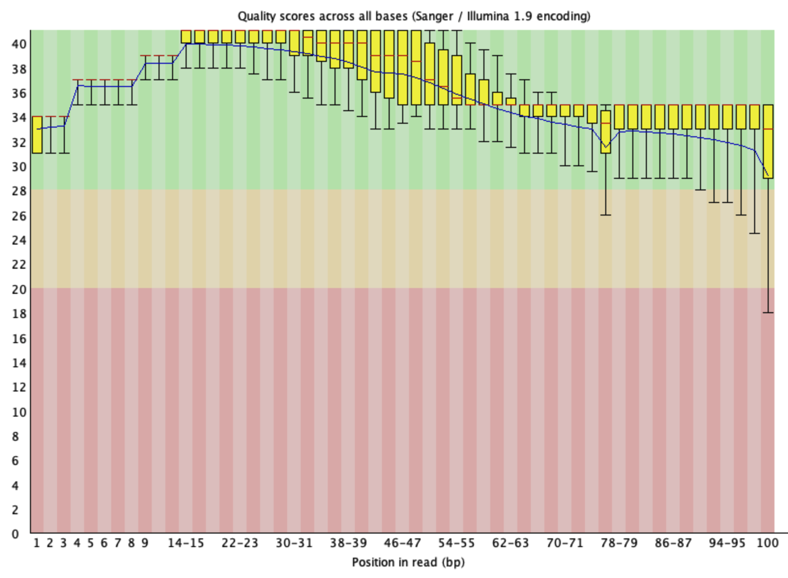
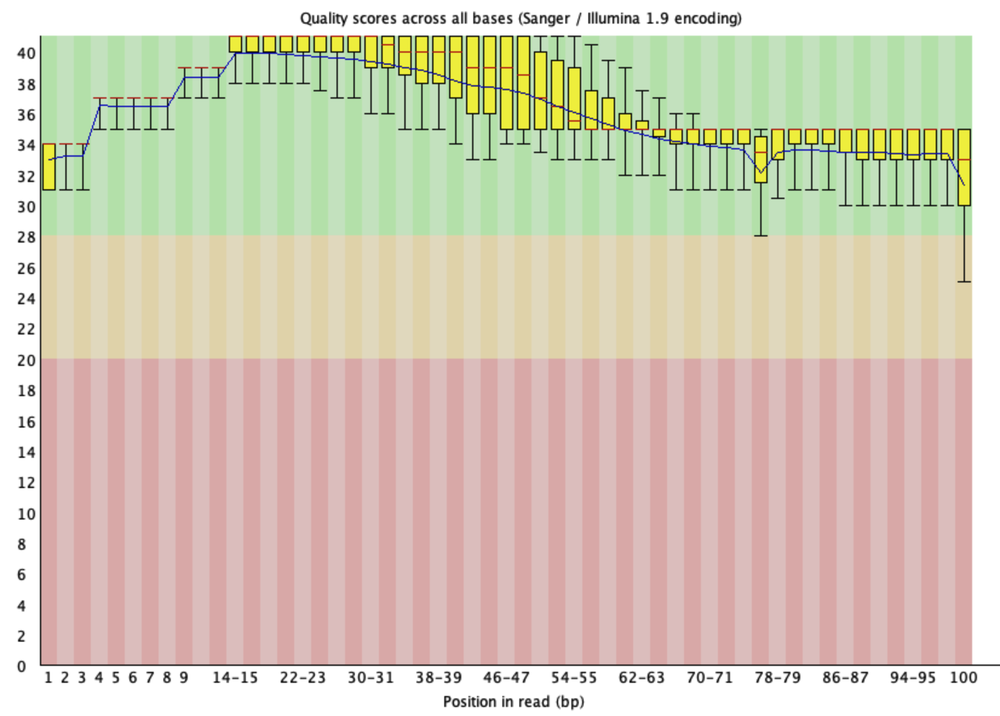
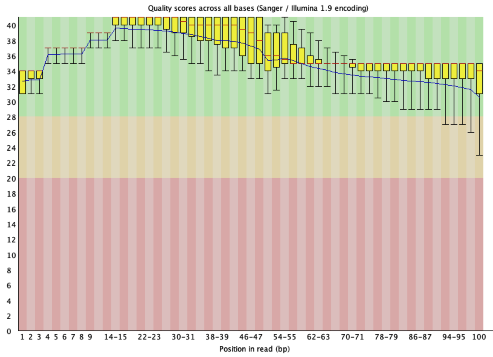
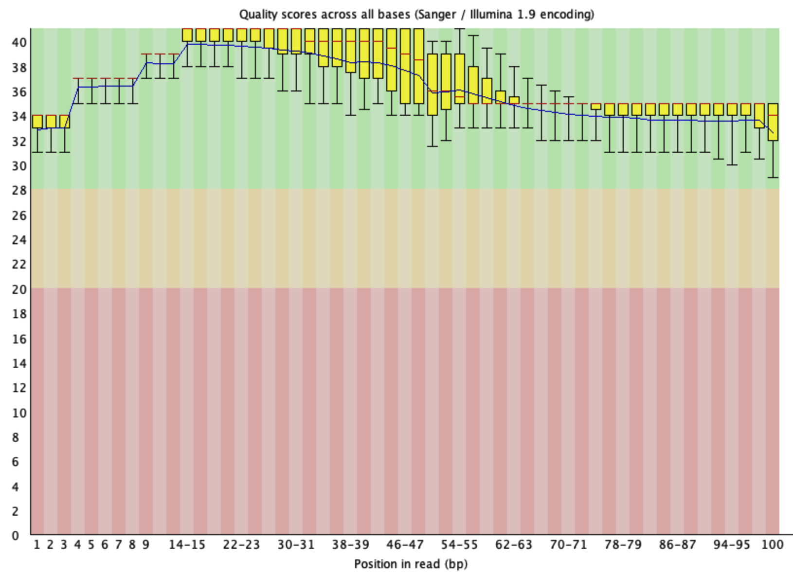
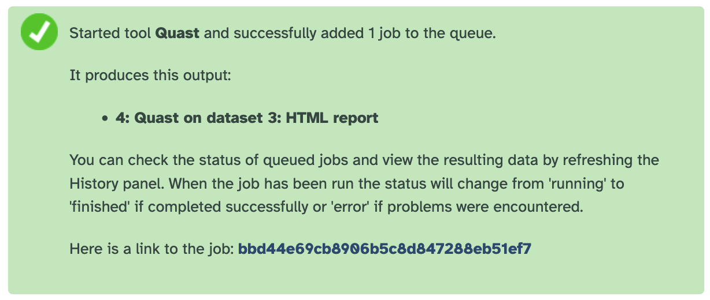
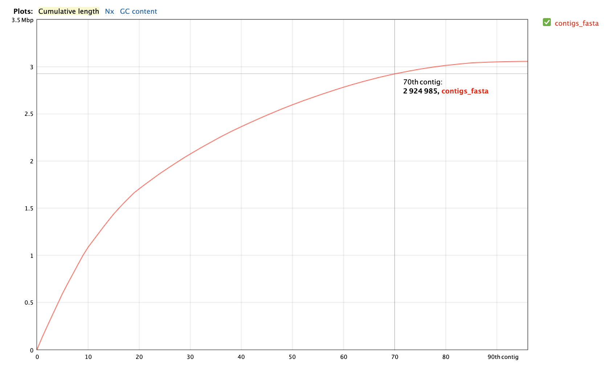
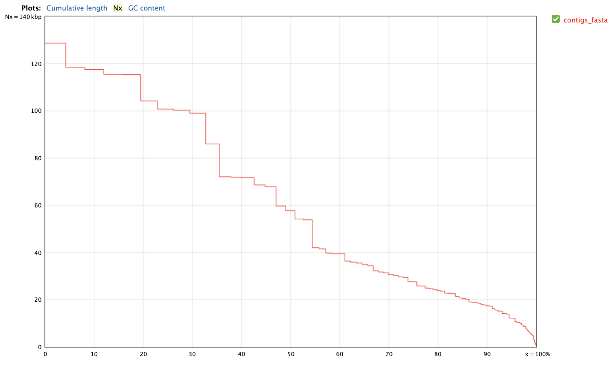
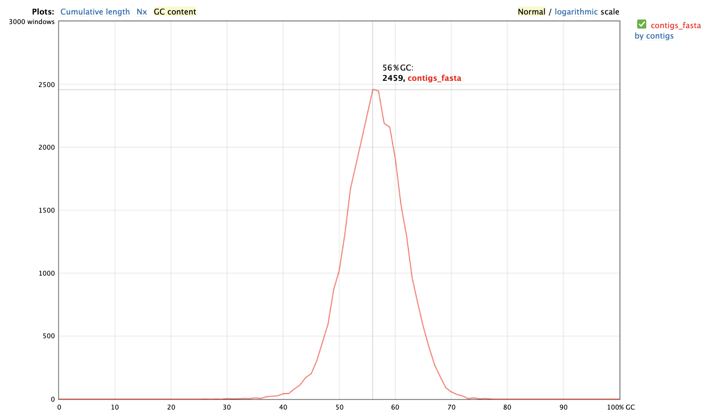
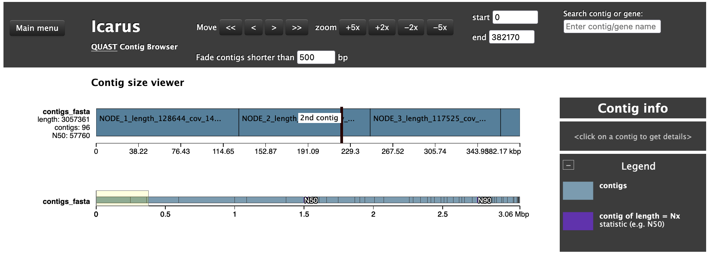
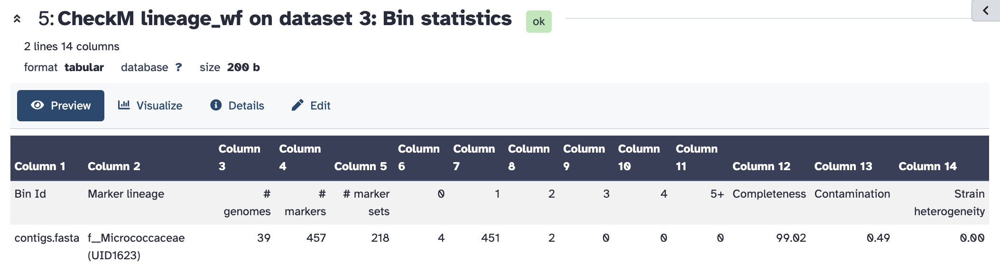

# Lesson 04. Report for 18/05

> Anna Miletova, 89231151

# 1. Download of data and installation of packages

First, I downloaded the reads from the article PMC3960531 with the identification number ERR327955 using SRA tools:

```bash
fastq-dump --origfmt --skip-technical --read-filter pass --clip --split-3 -X 500000 ERR327955
```

# 2. Quality control of the data

I ran FastQC to check the quality of the data:

```bash
fastqc ERR327955_pass_1.fastq
fastqc ERR327955_pass_2.fastq
```

# 3. Trimming of the reads

I used FastP to trim the reads and check the quality of the data after trimming:

```bash
fastp -i ERR327955_pass_1.fastq -I ERR327955_pass_2.fastq -o ERR327955_trimmed_1.fq -O ERR327955_trimmed_2.fq -V --html fastp_report.html -u 30 -x -3

fastqc ERR327955_trimmed_1.fq
fastqc ERR327955_trimmed_2.fq
```

Here is the comparison of the quality of the data before and after trimming for the first read:




Comparison of the quality of the data before and after trimming for the second read:




We can see that the quality of the data has improved after trimming, especially in terms of the quality scores: the whisker never appear in the red zone for the first read and never appear in the yellow zone for the second read. Also, the percentage of bases with quality scores above 30 has increased significantly.

# 4. Assembly with SPADES

First I installed SPADES package:

```bash
conda install -c bioconda spades -y
```

Then I ran SPADES to assemble the reads:Then I ran SPAdes to assemble the trimmed paired-end reads:

```bash
spades.py -1 ERR327955_trimmed_1.fq -2 ERR327955_trimmed_2.fq -o spades_ERR327955_output  -t 4 -m 8
```

## Question: 

- ***What’s a kmer? In which analysis could be used?***

    A k-mer is a subsequence of length k extracted from a biological sequence. The lower the k, the better is the resolution of the assembly.

    k-mers are widely used in bioinformatics analyses such as genome assembly, read alignment, error correction, metagenomics, variant detection.

    In genome assembly tools like SPAdes, overlapping k-mers are used to construct de Bruijn graphs for reconstructing genomes from sequencing reads.

- ***How many contigs have you obtained?***

    ```bash
    grep -c "^>" spades_ERR327955_output/contigs.fasta 
    ```

    Result: 207 contigs.

    Also can be seen in the QUAST results: `# contigs (>= 0 bp)	| 207`

# 5. Evaluation of the assembly with QUAST

To evaluate the assembly, I switched to Galaxy (since I couldn't install it locally). First I uploaded the contigs file from SPADES output to Galaxy (`/l4/spades_ERR327955_output/contigs.fasta`) and then I ran QUAST to evaluate the assembly:




## The results of QUAST:

| Statistics without reference | contigs_fasta |
| --- | --- |
| # contigs	| 96| 
| # contigs (>= 0 bp)	| 207
| # contigs (>= 1000 bp)	| 92
| # contigs (>= 5000 bp)	| 83
| # contigs (>= 10000 bp)	| 74
| # contigs (>= 25000 bp)	| 40
| # contigs (>= 50000 bp)	| 19
| Largest contig	| 128644
| Total length	| 3057361
| Total length (>= 0 bp)	| 3068370
| Total length (>= 1000 bp)	| 3054761
| Total length (>= 5000 bp)	| 3031513
| Total length (>= 10000 bp)	| 2966383
| Total length (>= 25000 bp)	| 2365447
| Total length (>= 50000 bp)	| 1663277
| N50	| 57760
| N90	| 17445
| auN	| 63031
| L50	| 17
| L90	| 59
| GC (%)	| 56.25

| Per base quality | |
| --- | --- |
| # N's per 100 kbp	| 0 |
| # N's	| 0 |

### Cumulative length of the contigs:



### Nx:



### GC content:



### Icarus browser:




## Question: 

  - ***What is N50?  And L50? Describe these parameters.***

  N50 is a measure of assembly contiguity. It is the contig length such that 50% of the total assembly length is contained in contigs of that size or longer.

  L50 is the minimum number of largest contigs needed to cover 50% of the total assembly length.

# 6. CheckM analysis

To check the completeness and contamination of the assembly, I ran `CheckM lineage_wf` in Galaxy:



# 7. BUSCO analysis

For some reason, I was not able to run BUSCO locally, so I also ran it in Galaxy. First I ran BUSCO evaluation with the `bacteria_odb10` database and retrieved the following results:

    # BUSCO version is: 5.8.0 
    # The lineage dataset is: bacteria_odb12 (Creation date: 2025-05-14, number of genomes: 3130, number of BUSCOs: 116)
    # Summarized benchmarking in BUSCO notation for file /jetstream2/scratch/main/jobs/77143754/working/input.fa
    # BUSCO was run in mode: prok_genome_prod
    # Gene predictor used: prodigal

        ***** Results: *****

        C:99.1%[S:99.1%,D:0.0%],F:0.0%,M:0.9%,n:116	   
        115	Complete BUSCOs (C)			   
        115	Complete and single-copy BUSCOs (S)	   
        0	Complete and duplicated BUSCOs (D)	   
        0	Fragmented BUSCOs (F)			   
        1	Missing BUSCOs (M)			   
        116	Total BUSCO groups searched		   

    Assembly Statistics:
        207	Number of scaffolds
        207	Number of contigs
        3068370	Total length
        0.000%	Percent gaps
        57 KB	Scaffold N50
        57 KB	Contigs N50


Then I ran BUSCO evaluation with the `micrococcaceae_odb12` database, since CheckM assigned the assembly to the family Micrococcaceae. The results were the following:

    # BUSCO version is: 5.8.0 
    # The lineage dataset is: micrococcaceae_odb12 (Creation date: 2025-05-14, number of genomes: 65, number of BUSCOs: 740)
    # Summarized benchmarking in BUSCO notation for file /anvil/scratch/x-xcgalaxy/jobs/main/77144772/working/input.fa
    # BUSCO was run in mode: prok_genome_prod
    # Gene predictor used: prodigal

        ***** Results: *****
        C:94.6%[S:94.6%,D:0.0%],F:2.3%,M:3.1%,n:740	   
        700	Complete BUSCOs (C)			   
        700	Complete and single-copy BUSCOs (S)	   
        0	Complete and duplicated BUSCOs (D)	   
        17	Fragmented BUSCOs (F)			   
        23	Missing BUSCOs (M)			   
        740	Total BUSCO groups searched		   

    Assembly Statistics:
        207	Number of scaffolds
        207	Number of contigs
        3068370	Total length
        0.000%	Percent gaps
        57 KB	Scaffold N50
        57 KB	Contigs N50


The results of BUSCO analysis show that the assembly is of high quality, with 99.1% of the BUSCOs being complete when using the `bacteria_odb12` database and 94.6% when using the `micrococcaceae_odb12` database. The percentage of fragmented and missing BUSCOs is low, indicating that the assembly is relatively complete and of a good quality. The N50 value of 57 KB also suggests that the assembly is reasonably contiguous.

