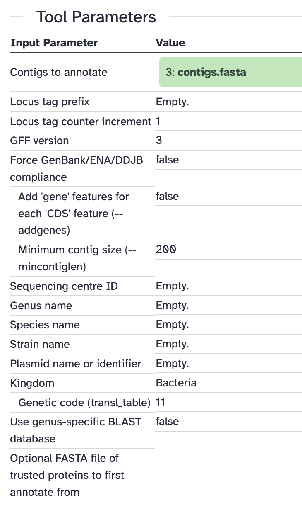
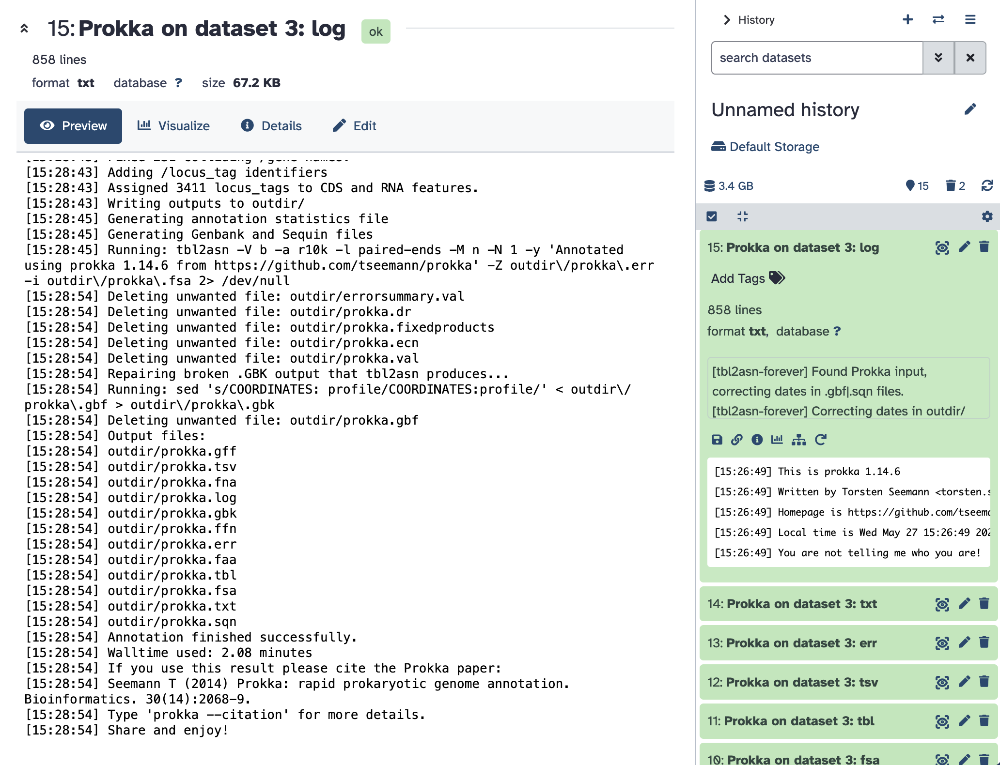
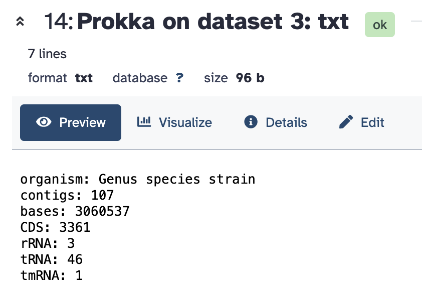

# Lesson 05. Report for 26/05

> Anna Miletova, 89231151

## 1. Genome annotation with Prokka

Since it was impossible to install Prokka locally, I used Galaxy to run it. I uploaded the assembly file from SPADES output and ran Prokka with default parameters.



It ran successfully, so annotation is complete:



### Questions

> How many genes were retrieved in the gff3 of PROKKA output. How can you count that?

1.    In the txt summary of Prokka output, the number of CDS features is 3361.



Another way is to download locally the results of the Prokka annotation and use the following command to count the number of CDS features in the gff3 file:

```
grep -c $'\tCDS\t' ./prokka_output/*.gff3
```


## 2. BUSCO results

After that I ran BUSCO directly in Galaxy too.

The results are the following:

    # BUSCO version is: 5.8.0 
    # The lineage dataset is: bacteria_odb12 (Creation date: 2025-05-14, number of genomes: 3130, number of BUSCOs: 116)
    # Summarized benchmarking in BUSCO notation for file /expanse/lustre/scratch/xgalaxy/temp_project/jobs/main/77528588/working/input.fa
    # BUSCO was run in mode: prok_genome_prod
    # Gene predictor used: prodigal

        ***** Results: *****

        C:99.1%[S:99.1%,D:0.0%],F:0.0%,M:0.9%,n:116	   
        115	Complete BUSCOs (C)			   
        115	Complete and single-copy BUSCOs (S)	   
        0	Complete and duplicated BUSCOs (D)	   
        0	Fragmented BUSCOs (F)			   
        1	Missing BUSCOs (M)			   
        116	Total BUSCO groups searched		

### Summary

The results show that 99.1% of the BUSCOs were complete, with 115 being single-copy and none duplicated. There were no fragmented BUSCOs, and only 0.9% were missing, indicating a high-quality genome assembly.
